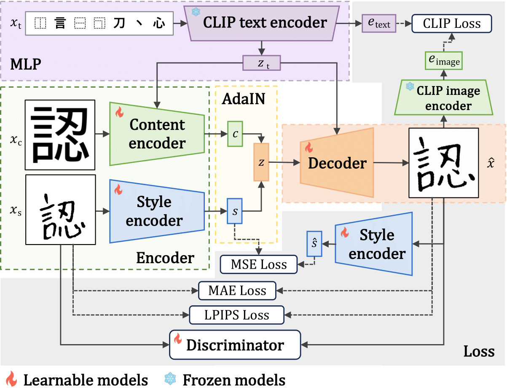

# Handwritten Character Image Generation for Effective Data Augmentation
This study introduces data augmentation techniques to enhance training datasets for a Japanese handwritten character classification model, addressing the high cost of collecting extensive handwritten character data. A novel method is proposed to automatically generate a large-scale dataset of handwritten characters from a smaller dataset, utilizing a style transformation approach, particularly Adaptive Instance Normalization (AdaIN). Additionally, the study presents an innovative technique to improve character structural information by integrating features from the Contrastive Language-Image Pre-training (CLIP) text encoder. This approach enables the creation of diverse handwritten character images, including kanji, by merging content and style elements. The effectiveness of our approach is demonstrated by evaluating a handwritten character classification model using an expanded dataset, which includes Japanese hiragana, katakana, and kanji from the ETL Character Database.

## Approach


## Usage
First, get the data you need for this study
- [ETL database](http://etlcdb.db.aist.go.jp/?lang=ja)

Once downloaded, manage it with JSON as shown below:
```
{
  "あ": [
    "Path to "あ" Image",
    ...
  ],
  "い": [
    "Path to "い" Image",
    ...
  ]
}
```

- [Adobe fonts](https://fonts.adobe.com/)（Please download the fonts mentioned in [use_font.txt](information/use_font.txt)）

then install this repo as a Python package. On a CUDA GPU machine, the following will do the trick:
```bash
$ pip install git@github.com:nishizaki-lab/Handwritten-Character-Image-Generation.git
```

## Reproduction of experiments
### Training style transfer generated model
- Step1 : Training CLIP
- Step2 : Training generated model
- Step3 : Character classification experiment

#### Step1 Training CLIP
Navigate to the directory and initiate CLIP training, following the pre-training phase of both image encoder and text encoder.
Please adjust the required file paths to match your specific environment.
```bash
$ cd training_clip
$ python3 train_image_encoder.py --aug
$ python3 train_text_encoder.py --aug
$ python3 train_clip.py　　--image_weight　"path to image encoder weight" --text_weight "path to text encoder weight"
```

#### Step2 Training generated model
##### Style transfer generated model
A pre-trained CLIP model is required to train a generative model for style transformation.

By adjusting the model mode, you can train various models including AdaIN, AdaIN with MLP (Embedding), and AdaIN with MLP (CLIP text encoder).

Learning is learned through 4 steps
```bash
$ cd training_style_transfer
$ python3 train.py -mm "AdaIN" or "AdaIN with MLP" or "AdaIN wit CLIP" --clip_weight "path to CLIP weight" --step_type step1
$ python3 train.py -mm "AdaIN" or "AdaIN with MLP" or "AdaIN wit CLIP" --clip_weight "path to CLIP weight" --step_type step2 --gen_weight "path to step1 gen weight" --disc_weight "path to step1 disc weight"
$ python3 train.py -mm "AdaIN" or "AdaIN with MLP" or "AdaIN wit CLIP" --clip_weight "path to CLIP weight" --step_type step3 --gen_weight "path to step2 gen weight" --disc_weight "path to step2 disc weight"
$ python3 train.py -mm "AdaIN" or "AdaIN with MLP" or "AdaIN wit CLIP" --clip_weight "path to CLIP weight" --step_type step_end --gen_weight "path to step3 gen weight" --disc_weight "path to step3 disc weight"
```

##### Conditional diffusion model
coming soon...

#### Step3 Character classification experiment
Conduct experiments to assess the effectiveness of utilizing images generated by the model as training data for character classification model.
```bash
$ cd training_character_classification
```
- base line
```bash
$ python3 train.py --use_gen ""
```
- add generated images
The path of the generated image is managed by JSON as well as ETL.
```bash
$ python3 train.py --use_gen "path to JSON"
```

To evaluate the impact of variations in the generated images on the accuracy of each character classification, add the model path for each recognizer to the [test.py](training_character_classification/test.py)
```bash
$ python3 test.py
```


